<h1 align="center">Hey  I'm Abhimanyu Sharma</h1>

  

## 📌 About Me
- I'm a full-stack AI developer building at the intersection of machine learning, systems programming, and full-stack development.
- I work across the whole stack backend APIs and dashboards in Next.js/React, C++ game engine internals, and LLM-powered applications. Every project I take goes from concept to deployment.

## 📊 GitHub Stats & Trophies

  
  

  

  

## 🛠️ Languages & Tools

<h3 align="center">Programming Languages</h3>

  &nbsp;&nbsp;
  &nbsp;&nbsp;
  &nbsp;&nbsp;
  &nbsp;&nbsp;
  &nbsp;&nbsp;
  

<h3 align="center">Frontend</h3>

  &nbsp;&nbsp;
  &nbsp;&nbsp;
  &nbsp;&nbsp;
  &nbsp;&nbsp;
  

<h3 align="center">Backend</h3>

  &nbsp;&nbsp;
  &nbsp;&nbsp;
  &nbsp;&nbsp;
  

<h3 align="center">Database</h3>

  &nbsp;&nbsp;
  &nbsp;&nbsp;
  

<h3 align="center">DevOps & Cloud</h3>

  &nbsp;&nbsp;
  &nbsp;&nbsp;
  

<h3 align="center">Tools</h3>

  &nbsp;&nbsp;
  &nbsp;&nbsp;
  &nbsp;&nbsp;
  

  

## 🔗 Connect with Me

  &nbsp;&nbsp;
  

## 💬 Quote
> "That which does not Kill us makes us Stronger" - Friedrich Nietzsche

  

  

